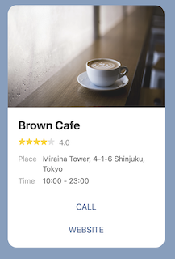

# 概觀
Kamiflex 讓你以程式碼的方式取代直接編寫 Flex Messages 的 JSON，達到方便、簡潔、易維護易擴展的目的。Kamiflex 目前僅支援Line平台上的 Flex Message，在 Kamiflex 之下 Line Flex Message 的架構如下：


Kamiflex 使用 Ruby 中的 [Block](https://5xruby.tw/posts/discover-ruby-block) 實作，各元件間以 Block 組裝，達成類巢狀函式的寫法。

以下示範[Line Flex Message Simulator](https://developers.line.biz/flex-simulator/?status=success)中的 Showcase：

  

Kamiflex 的寫法：
```ruby
Kamiflex.json(self) do
  bubble do
    hero "https://scdn.line-apps.com/n/channel_devcenter/img/fx/01_1_cafe.png",
      size: :full, aspectRatio: "20:13", aspectMode: :cover, action: uri_action("http://linecorp.com/")
    body do
      text "Brown Cafe", weight: :bold, size: :xl
      baseline_box margin: :md do
        icon "https://scdn.line-apps.com/n/channel_devcenter/img/fx/review_gold_star_28.png", size: :sm
        icon "https://scdn.line-apps.com/n/channel_devcenter/img/fx/review_gold_star_28.png", size: :sm
        icon "https://scdn.line-apps.com/n/channel_devcenter/img/fx/review_gold_star_28.png", size: :sm
        icon "https://scdn.line-apps.com/n/channel_devcenter/img/fx/review_gold_star_28.png", size: :sm
        icon "https://scdn.line-apps.com/n/channel_devcenter/img/fx/review_gray_star_28.png", size: :sm
        text "4.0", size: :sm, color: "#999999", margin: :md, flex: 0
      end
      vertical_box margin: :lg, spacing: :sm do
        baseline_box spacing: :sm do
          text "Place", "color": "#aaaaaa", "size": "sm", "flex": 1
          text "Miraina Tower, 4-1-6 Shinjuku, Tokyo", "wrap": true, "color": "#666666", "size": "sm", "flex": 5
        end
        baseline_box spacing: :sm do
          text "Time", "color": "#aaaaaa", "size": "sm", "flex": 1
          text "10:00 - 23:00", "wrap": true, "color": "#666666", "size": "sm", "flex": 5
        end
      end
    end
    footer spacing: :sm, flex: 0 do
      url_button "CALL", "https://linecorp.com", style: :link, height: :sm
      url_button "WEBSITE", "https://linecorp.com", style: :link, height: :sm
      spacer size: :sm
    end
  end
end
```

其對應的Json：
```json
{
    "type": "flex",
    "altText": "this is a flex message",
    "contents": {
        "type": "bubble",
        "hero": {
            "type": "image",
            "url": "https://scdn.line-apps.com/n/channel_devcenter/img/fx/01_1_cafe.png",
            "size": "full",
            "aspectRatio": "20:13",
            "aspectMode": "cover",
            "action": {
                "type": "uri",
                "label": "http://linecorp.com/",
                "uri": "http://linecorp.com/"
            }
        },
        "body": {
            "type": "box",
            "layout": "vertical",
            "contents": [
                {
                    "type": "text",
                    "text": "Brown Cafe",
                    "weight": "bold",
                    "size": "xl"
                },
                {
                    "type": "box",
                    "layout": "baseline",
                    "contents": [
                        {
                            "type": "icon",
                            "url": "https://scdn.line-apps.com/n/channel_devcenter/img/fx/review_gold_star_28.png",
                            "size": "sm"
                        },
                        {
                            "type": "icon",
                            "url": "https://scdn.line-apps.com/n/channel_devcenter/img/fx/review_gold_star_28.png",
                            "size": "sm"
                        },
                        {
                            "type": "icon",
                            "url": "https://scdn.line-apps.com/n/channel_devcenter/img/fx/review_gold_star_28.png",
                            "size": "sm"
                        },
                        {
                            "type": "icon",
                            "url": "https://scdn.line-apps.com/n/channel_devcenter/img/fx/review_gold_star_28.png",
                            "size": "sm"
                        },
                        {
                            "type": "icon",
                            "url": "https://scdn.line-apps.com/n/channel_devcenter/img/fx/review_gray_star_28.png",
                            "size": "sm"
                        },
                        {
                            "type": "text",
                            "text": "4.0",
                            "size": "sm",
                            "color": "#999999",
                            "margin": "md",
                            "flex": 0
                        }
                    ],
                    "margin": "md"
                },
                {
                    "type": "box",
                    "layout": "vertical",
                    "contents": [
                        {
                            "type": "box",
                            "layout": "baseline",
                            "contents": [
                                {
                                    "type": "text",
                                    "text": "Place",
                                    "color": "#aaaaaa",
                                    "size": "sm",
                                    "flex": 1
                                },
                                {
                                    "type": "text",
                                    "text": "Miraina Tower, 4-1-6 Shinjuku, Tokyo",
                                    "wrap": true,
                                    "color": "#666666",
                                    "size": "sm",
                                    "flex": 5
                                }
                            ],
                            "spacing": "sm"
                        },
                        {
                            "type": "box",
                            "layout": "baseline",
                            "contents": [
                                {
                                    "type": "text",
                                    "text": "Time",
                                    "color": "#aaaaaa",
                                    "size": "sm",
                                    "flex": 1
                                },
                                {
                                    "type": "text",
                                    "text": "10:00 - 23:00",
                                    "wrap": true,
                                    "color": "#666666",
                                    "size": "sm",
                                    "flex": 5
                                }
                            ],
                            "spacing": "sm"
                        }
                    ],
                    "margin": "lg",
                    "spacing": "sm"
                }
            ]
        },
        "footer": {
            "type": "box",
            "layout": "vertical",
            "contents": [
                {
                    "type": "button",
                    "action": {
                        "type": "uri",
                        "label": "CALL",
                        "uri": "https://linecorp.com"
                    },
                    "style": "link",
                    "height": "sm"
                },
                {
                    "type": "button",
                    "action": {
                        "type": "uri",
                        "label": "WEBSITE",
                        "uri": "https://linecorp.com"
                    },
                    "style": "link",
                    "height": "sm"
                },
                {
                    "type": "spacer",
                    "size": "sm"
                }
            ],
            "spacing": "sm",
            "flex": 0
        }
    }
}
```
## 範例說明
在此範例中， Kamiflex 可拆解為四個部分講解。
### 第一部分 Flex Message Meta
```ruby
Kamiflex.json(self) do
    ...
end
```
此段為每一個 Flex Message 都必須使用的開頭，同時也是呼叫 Kamiflex 的 Class Method。

更多說明請查看 [Flex Message Meta](/kamiflex/flex_message_meta.md)

### 第二部分 核心元件
```ruby
Kamiflex.json(self) do # Flex Message Meta
  bubble do # 核心元件
    ...
  end
end
```
[bubble](/kamiflex/core.md#bubble) 屬於核心元件，是一個 Flex Message 必須包含的內容，其需放置在 Flex Message 的 `do ... end` 之中，對於 Flex Message Meta 而言是一個區塊中的方法。

在 bubble 的 `do ... end` 中，必須放置 [header](/kamiflex/core.md#header)、[body](/kamiflex/core.md#body) 或 [footer](/kamiflex/core.md#footer) 任一方法後，才可以放入 [容器元件](/kamiflex/container.md) 或是 [基礎組件](/kamiflex/basic_element.md)，更多說明請查看 [核心元件](/kamiflex/core.md)

### 第三部分 容器元件
```ruby
Kamiflex.json(self) do
    ...
    body do
      baseline_box margin: :md do #容器元件
        ...
      end
    end
end
```
[baseline_box](/kamiflex/container.md#baseline_box) 屬於容器元件，容器元件必須放置於 [header](/kamiflex/core.md#header)、[body](/kamiflex/core.md#body) 或 [footer](/kamiflex/core.md#footer) 這三種方法的 `do ... end` 之中。

更多說明請查看 [容器元件](/kamiflex/container.md)

### 第四部分 基礎組件
```ruby
Kamiflex.json(self) do
    ...
      vertical_box margin: :lg, spacing: :sm do # 容器元件
        baseline_box spacing: :sm do # 容器元件
          text "Place", "color": "#aaaaaa", "size": "sm", "flex": 1 # 基礎組件
          text "Miraina Tower, 4-1-6 Shinjuku, Tokyo", "wrap": true, "color": "#666666", "size": "sm", "flex": 5 # 基礎組件
        end
        baseline_box spacing: :sm do # 容器元件
          text "Time", "color": "#aaaaaa", "size": "sm", "flex": 1 # 基礎組件
          text "10:00 - 23:00", "wrap": true, "color": "#666666", "size": "sm", "flex": 5 # 基礎組件
        end
      end
    ...
end
```
此段中的 [text](/kamiflex/basic_element.md#text) 就是一種 [基礎組件](/kamiflex/basic_element.md)，基礎組件需被放在 [容器元件](/kamiflex/container.md) 之中。

更多說明請查看 [基礎組件](/kamiflex/basic_element.md)

## 引數
在部分的元件後會加入引數，可以達到賦值和修飾 style 的效果。
例如：
```ruby
text "Time", "color": "#aaaaaa", "size": "sm", "flex": 1
```
這是一個 [文字的基礎組件](/kamiflex/basic_element.md#text)

在 [Kamiflex/BasicElements.rb](https://github.com/etrex/kamiflex/blob/master/lib/kamiflex/basic_elements.rb) 中的定義如下：
```ruby
def text(message, **params)
      @flex_contents << {
        "type": "text",
        "text": message
      }.merge(params)
    end

```
依照定義，該元件可以接受兩種引數：
- `message` 為必填的引數
- `**params` 需傳入一個 Hash ，為選填的引數

因此例句中的 `"Time"` 是對應 `message` 的引數，`"color": "#aaaaaa", "size": "sm", "flex": 1` 的部分則是一個 Hash，對應 `**params`，而該段例句也可以寫成：
```ruby
text "Time",{ "color": "#aaaaaa", "size": "sm", "flex": 1}
```
但由於 `{}` 可以省略，因此才會變成原本的形式

每一個元件皆會說明其可接受的引數，除必填引數需按照順序填入，其餘選填引數則不受限制。

## 區塊中的方法
區塊指是 Ruby 中的 [Block](https://5xruby.tw/posts/discover-ruby-block) 也就是 `do ... end`，區塊中的方法將會在 `do ... end` 之中，每一個元件在區塊中可以放入的方法皆有所不同，如以下：
```ruby
Kamiflex.json(self) do
    bubble do
        body do
            text "Hello, World!"
        end
    end
end
```

根據下圖，在大部分的情況，各元件僅能包含下一層的元件：

  

在範例中，`bubble` 是個核心元件，因此會被包含在 Flex Message Meta 的 `do ... end` 之中，而`text`是個基礎組件，因此會被包含在容器元件之中(`body`會預設產生一個容器元件)。

但也有另外，例如以下範例：
```ruby
Kamiflex.json(self) do
    alt_text: "this is a flex message"
    bubble do
        body do
            text "Hello, World!"
        end
    end
end
```
`alt_text`並不屬於任何一個元件，但其該放置的位置為 Flex Message Meta 的 `do...end` 之中，關於各元件 `do...end` 中可使用的方法請依照其區塊中的方法。
